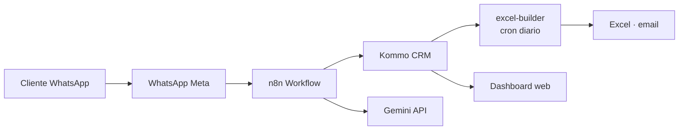

# Handoff Final · \<Cliente\> · \<Proyecto\> · YYYY-MM-DD

**De:** Creators Latam
**Para:** \<nombre del sponsor del cliente\>
**Fecha de handoff:** YYYY-MM-DD
**Estado:** 🟢 Listo para firma

---

## 1. Qué entregamos

| # | Entregable | Ubicación | Formato | Aprobado en Fase 1? |
|---|---|---|---|---|
| 1 | Reporte semanal de leads | `output/reportes/reporte-leads-*.xlsx` | Excel | ✓ |
| 2 | Bot WhatsApp · respuesta automática | n8n + Meta | Workflow + templates | ✓ |
| 3 | Dashboard KPIs | hosted en Railway | Web app | ✓ |

## 2. Cómo funciona (arquitectura de alto nivel)

Ver diagramas detallados en [`documentation/arquitectura.pdf`](./arquitectura.pdf) (también en este paquete).

## 3. Cómo operar día a día

### Qué tenés que mirar cada día
- **Dashboard** (link): estado de leads del día, tasa respuesta bot.
- **Slack/Email de alertas**: errores críticos que requieran acción.

### Qué tenés que hacer cada semana
- **Lunes 9am:** recibís el Excel automático por email. Revisá que haya llegado.
- **Revisar métricas** del dashboard. Si algo cae >30% vs la semana anterior → avisá.

### Qué tenés que hacer cada mes
- Revisar costos de APIs (Kommo, WhatsApp, Gemini). Ver sección de [Costos](#8-costos-y-monitoreo).
- Revisar backlog de tickets no respondidos.

## 4. Cómo mantener

### Cadencia sugerida

| Frecuencia | Acción | Quién |
|---|---|---|
| Diario | Revisar dashboard + alertas | Equipo ops |
| Semanal | Revisar Excel de reportes | PM del cliente |
| Mensual | Review de costos + métricas | PM + finanzas |
| Trimestral | Actualizar dependencias | DevOps |

### Actualizaciones recomendadas

- **n8n** — actualizar cada 3 meses (release notes en their website).
- **Node.js / Python** — versiones LTS, cambiar cada año.
- **Claves API** — rotar cada 6 meses como higiene.

## 5. Qué hacer si algo falla

### Runbook de incidentes comunes

#### El bot no responde en WhatsApp
1. Chequear estado de Meta: https://metastatus.com
2. Revisar logs del workflow n8n.
3. Chequear que el template WhatsApp no esté bloqueado.
4. Si persiste, escribirnos al contacto de soporte.

#### El Excel semanal no llegó
1. Chequear que el cron del workflow n8n esté activo.
2. Revisar logs de Kommo API (¿rate limit?).
3. Correr manual desde n8n para testear.

#### El dashboard está caído
1. Chequear Railway: https://railway.app/project/xxx
2. Ver logs de la app.
3. Redeploy desde Railway UI si hace falta.

### Escalamiento

Si lo de arriba no resuelve:
- **Creators Latam soporte:** info@creatorslatam.com · +51 995 547 575
- **Horario de respuesta:** L-V 9-18 (GMT-5). Fuera de eso, WhatsApp con tag `#urgente`.

## 6. Credenciales · método de transferencia

⚠️ **Las credenciales NO están en este documento.** Fueron compartidas via:

- **Vault:** 1Password · Vault "Acme Project"
- **Acceso:** invitación enviada a `<email-sponsor>` el YYYY-MM-DD
- **Recovery codes** de 2FA: en el mismo vault, item "2FA Recovery Codes"

### Lista de credenciales (solo nombres, NO valores)

- [ ] `KOMMO_API_KEY` · acceso al CRM
- [ ] `KOMMO_SUBDOMAIN`
- [ ] `WHATSAPP_API_TOKEN` · Meta Business
- [ ] `WHATSAPP_PHONE_ID`
- [ ] `GEMINI_API_KEY` · Google
- [ ] `RAILWAY_TOKEN` · deploy dashboard
- [ ] `N8N_WEBHOOK_URL`
- [ ] `SENTRY_DSN` · monitoring

## 7. Capacitación

- **Grabación de sesión:** [link a Google Drive / Loom]
- **Material de apoyo:** [`documentacion/slides-capacitacion.pdf`](./slides-capacitacion.pdf)
- **Quién recibió capacitación del lado del cliente:**
  - Juan Pérez · PM
  - Ana García · Analista

Si alguien más necesita capacitación, coordinamos sesión adicional sin costo en los primeros 30 días.

## 8. Costos y monitoreo

Generado por el agente `cost-tracker`.

| Servicio | Costo mensual estimado | Plan |
|---|---|---|
| Kommo CRM | USD 77 | Advanced (5 users) |
| WhatsApp Meta | USD 10–30 | Pay as you go |
| n8n Cloud | USD 20 | Starter |
| Railway | USD 15 | Developer |
| Gemini | USD 5–15 | Pay as you go |
| **Total estimado** | **USD 130–160** | — |

Ver detalle completo en [`documentation/costos.md`](./costos.md).

## 9. Plan post-handoff (si aplica)

- **Soporte incluido:** 30 días post-handoff sin costo.
- **Después:** contrato de soporte mensual (USD XXX/mes) opcional.
- **Mejoras futuras:** tenemos un backlog priorizado en [`documentation/backlog-mejoras.md`](./backlog-mejoras.md).

## 10. Aprobación del handoff

**Del lado Creators Latam:**
- [ ] Todos los entregables en `output/handoff/` validados
- [ ] Documentación completa
- [ ] Credenciales transferidas via vault
- [ ] Capacitación realizada
- [ ] Feedback recibido del cliente (via `comentarios-adicionales`)

**Del lado del cliente:**
- [ ] Recibí todos los entregables y funcionan
- [ ] Tengo acceso a todas las credenciales necesarias
- [ ] La capacitación fue suficiente
- [ ] Sé a quién escribirle si algo falla
- [ ] Tengo copia de esta documentación

**Firmas**

Cliente: \_\_\_\_\_\_\_\_\_\_\_\_\_\_ fecha: \_\_\_\_\_\_\_

Creators Latam: \_\_\_\_\_\_\_\_\_\_\_\_\_\_ fecha: \_\_\_\_\_\_\_

---

## Anexos (dentro del paquete de handoff)

- [`entregables/`](./entregables/) — todos los archivos finales
- [`documentacion/`](./documentacion/) — docs técnicas renderizadas
- [`capacitacion/`](./capacitacion/) — grabación + slides
- [`ACCESO/instrucciones.md`](./ACCESO/instrucciones.md) — cómo acceder al vault
