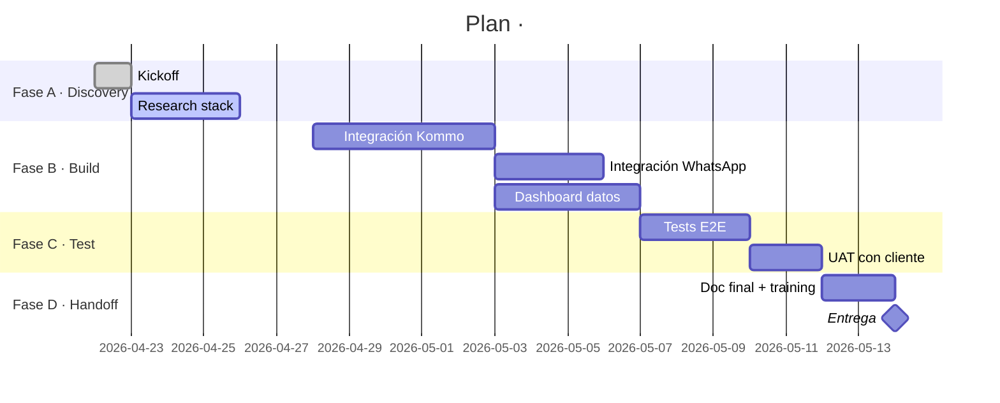

# Plan Maestro · \<Cliente\> · \<Proyecto\>

**Fecha inicio:** YYYY-MM-DD
**Responsable Creators Latam:** <nombre>
**Contacto cliente:** <nombre, email, teléfono>
**Estado:** 🔴 En definición / 🟡 En aprobación / 🟢 Aprobado

---

> Este Plan Maestro se completa en 3 fases con el agente **[`onboarding-pm`](../.claude/agents/onboarding-pm.md)**.
> Sin este documento aprobado, no se ejecuta nada.
> La lógica: pensar desde el entregable → stack tecnológico → equipo que lo ejecuta.

---

## 🎯 FASE 1 · Entregables (pensar desde el final)

> *"¿Qué archivo, pantalla o experiencia tiene que existir cuando terminemos?"*
> Trabajamos de adelante hacia atrás. Primero el entregable final, después cómo se produce.

### Entregable A · \<nombre descriptivo\>

| Campo | Definición |
|---|---|
| **Formato** | (Excel / CSV / JSON / Dashboard / PDF / Bot de WhatsApp / ...) |
| **Ubicación** | `output/<ruta-exacta>` |
| **Frecuencia** | Una vez / Semanal / On-demand / Tiempo real |
| **Aprobación** | Quién dice "esto sirve" y cómo lo valida |

**Estructura del contenido:**
- Columna/sección 1: `nombre` · tipo · de dónde sale
- Columna/sección 2: `...`
- …

**KPIs o métricas clave** (si aplica):
- `métrica_1` — fórmula, unidad, fuente
- `métrica_2` — …

**Fuentes de datos:**
- [ ] Fuente 1: API / BD / archivo / scraping de...
- [ ] Fuente 2: ...

**Criterio de aprobación:**
> *"El cliente abre esto y dice ___."*

---

### Entregable B · \<nombre\>
*(repetir bloque)*

---

### ✅ Checkpoint Fase 1

Antes de pasar a Fase 2, confirmar todos estos puntos:

- [ ] Cada entregable tiene formato y ubicación exactos.
- [ ] Cada columna/campo tiene una fuente trazable.
- [ ] Cada KPI tiene fórmula definida.
- [ ] Criterio de aprobación documentado y acordado.
- [ ] Cliente confirmó por escrito: *"sí, esto es lo que necesito"*.

**Aprobado por cliente:** \_\_\_\_\_\_ fecha: \_\_\_\_\_
**Aprobado por Creators Latam:** \_\_\_\_\_\_ fecha: \_\_\_\_\_

---

## 🛠️ FASE 2 · Stack Tecnológico (qué usamos y por qué)

> *"¿Con qué herramientas producimos los entregables de la Fase 1?"*
> Acá NO alcanza con "lo que dijo el cliente". Hay que investigar en foros, comparar alternativas, revisar limitaciones reales.

### 2.1 · Lo que ya tiene el cliente

| Categoría | Herramienta actual | Plan/Versión | Credenciales listas |
|---|---|---|---|
| CRM | (Kommo / HubSpot / Pipedrive / ...) | | |
| Mensajería | (WhatsApp API / Twilio / ...) | | |
| Workflow | (n8n / Zapier / Make / ...) | | |
| Cloud | (AWS / Railway / Vercel / GCP / ...) | | |
| Base de datos | (Postgres / Mongo / Airtable / ...) | | |
| Email | (SendGrid / Mailgun / SES / ...) | | |
| Analítica | (GA / Mixpanel / Amplitude / ...) | | |
| Otros | | | |

### 2.2 · TDRs / Restricciones del cliente

- **No se puede tocar:** …
- **Estándares a cumplir:** (GDPR, PCI, ISO, normativa local…)
- **Limitaciones de presupuesto:** USD ___ / mes
- **Deadline firme:** YYYY-MM-DD
- **Personas que deben mantener esto después:** <nombre, nivel técnico>

### 2.3 · Research por cada herramienta externa

Para cada API/herramienta que vayamos a integrar, crear un MD en `documentation/stack/<herramienta>.md` usando [`templates/api-research.md`](./api-research.md).

| Herramienta | Research MD | Riesgos detectados | Alternativas evaluadas |
|---|---|---|---|
| Ejemplo: Kommo API | `documentation/stack/kommo.md` | Rate limit 7/s; OAuth tricky | HubSpot, Pipedrive |
| | | | |

**⚠️ Regla dura:** ninguna herramienta entra al stack sin research documentado.

### 2.4 · Fuentes consultadas (cada herramienta)

No quedarse sólo con los docs oficiales. Cruzar con:

- [ ] StackOverflow (últimos 6 meses)
- [ ] Reddit (subreddit de la herramienta)
- [ ] GitHub issues (abiertos + cerrados recientes)
- [ ] Hacker News threads
- [ ] Dev.to / Medium / blogs técnicos
- [ ] Discord / Slack oficial si existe
- [ ] YouTube tutoriales recientes

### 2.5 · Stack final propuesto

| Capa | Herramienta | Por qué esta y no otra | Costo mensual estimado |
|---|---|---|---|
| … | … | … | USD … |

### ✅ Checkpoint Fase 2

- [ ] Todas las herramientas tienen research en `documentation/stack/`.
- [ ] Al menos 2 alternativas evaluadas por cada herramienta nueva.
- [ ] Riesgos conocidos documentados con mitigación.
- [ ] Costo mensual total estimado y aprobado por cliente.
- [ ] TDRs del cliente revisados punto por punto.

**Aprobado por cliente:** \_\_\_\_\_\_ fecha: \_\_\_\_\_
**Aprobado por Creators Latam:** \_\_\_\_\_\_ fecha: \_\_\_\_\_

---

## 👥 FASE 3 · Equipo y Plan de Trabajo

> Con entregables (Fase 1) y stack (Fase 2) claros, armamos el equipo que lo ejecuta.

### 3.1 · Agentes del starter que usamos

| Agente | Para qué en este proyecto |
|---|---|
| `orquestador` | Coordinar ejecución de todas las fases operativas |
| `compilador-datos` | Consolidar datos de Kommo + HubSpot en el Excel |
| `integraciones` | Conectar WhatsApp + Kommo via n8n |
| `tester` | Validar el flujo end-to-end |
| `guardian-reglas` | Auditar antes de cada entrega al cliente |
| ... | ... |

### 3.2 · Agentes custom del proyecto

Agentes específicos que hay que crear en `.claude/agents/` para este proyecto.

#### Agente: `<nombre>`
- **Descripción:** cuándo se invoca
- **Tools:** Read, Write, Bash, …
- **Archivo:** `.claude/agents/<nombre>.md`

*(repetir por cada agente nuevo)*

### 3.3 · Skills adicionales

Skills específicos que agregamos en `.claude/skills/`:

- `<nombre-skill>` — para qué sirve

### 3.4 · Plan de trabajo (Gantt)

Generar con `diagramador-mermaid`:

### 3.5 · Puntos de validación con el cliente

| # | Cuándo | Qué se valida | Quién valida |
|---|---|---|---|
| V1 | Fin Fase A | Research stack | Cliente + Creators Latam |
| V2 | Mid Fase B | Demo de integración | Cliente |
| V3 | Fin Fase C | UAT entregables finales | Cliente |
| V4 | Handoff | Documentación + acceso | Cliente |

### 3.6 · Comunicación del proyecto

- **Canal oficial:** (WhatsApp / Slack / Email)
- **Sync semanal:** (día, hora, participantes)
- **Reporting async:** (cadencia, formato)
- **Sign-off de entregables:** (cómo se formaliza)

### ✅ Checkpoint Fase 3

- [ ] Todos los agentes custom tienen archivo en `.claude/agents/`.
- [ ] Gantt aprobado por cliente.
- [ ] Hitos de validación en calendario.
- [ ] Canal de comunicación definido.

**Aprobado por cliente:** \_\_\_\_\_\_ fecha: \_\_\_\_\_
**Aprobado por Creators Latam:** \_\_\_\_\_\_ fecha: \_\_\_\_\_

---

## 🔒 Fuera de alcance

Lo que NO hacemos en este proyecto (tan importante como lo que sí):

- …
- …

---

## ⚠️ Riesgos del proyecto

| Riesgo | Probabilidad | Impacto | Mitigación |
|---|---|---|---|
| Rate limit de la API de X | Media | Alto | Batching + retry exponencial |
| … | | | |

---

## 🚀 Activación

Con las **3 fases aprobadas**, el `onboarding-pm` pasa el relevo al `orquestador`, que arranca la ejecución agente por agente.

**Fecha de activación:** \_\_\_\_\_\_\_\_
**Aprobación final cliente:** \_\_\_\_\_\_\_\_ (firma)
**Aprobación final Creators Latam:** \_\_\_\_\_\_\_\_ (firma)

---

*Este documento es vivo. Cualquier cambio post-aprobación requiere versionado (ver agente `versionador`) y nueva firma.*
